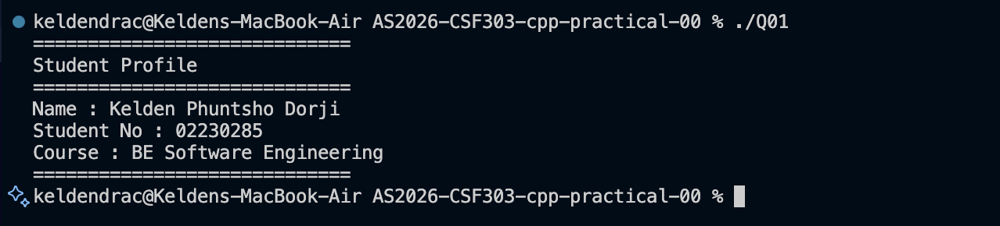
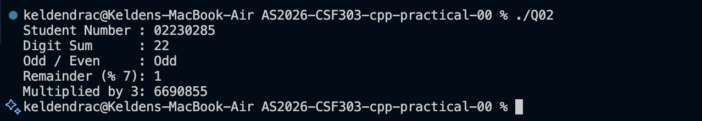
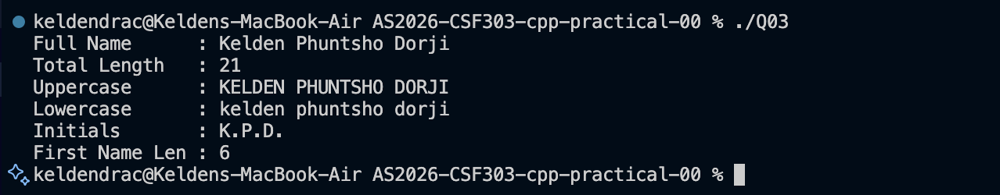
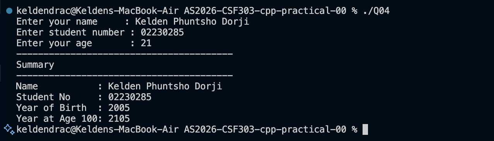
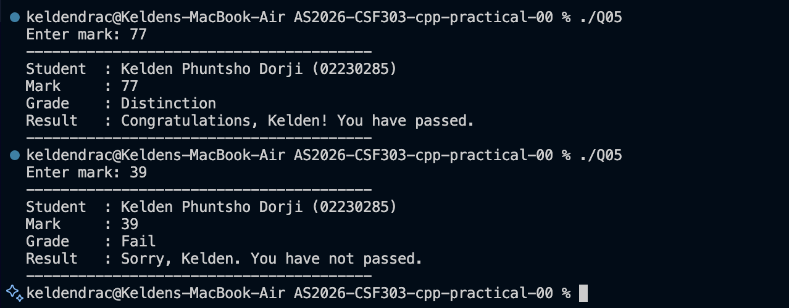
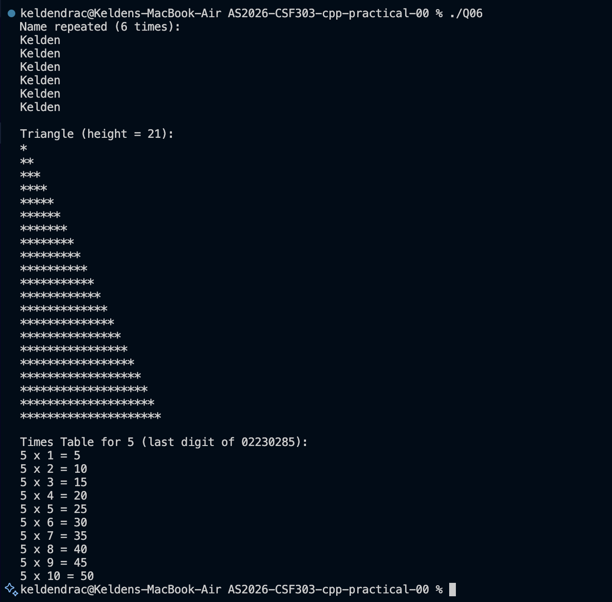
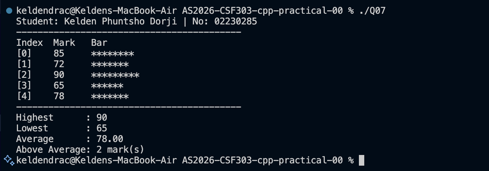
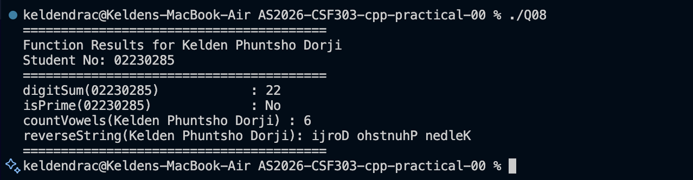
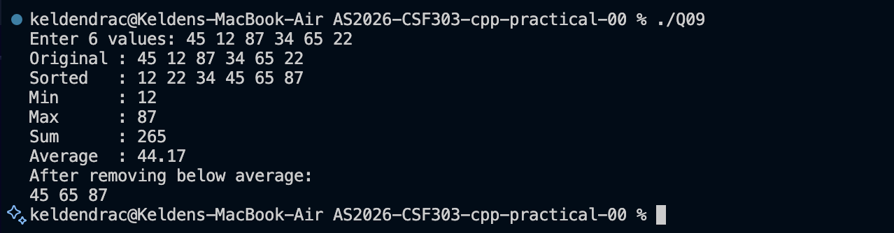
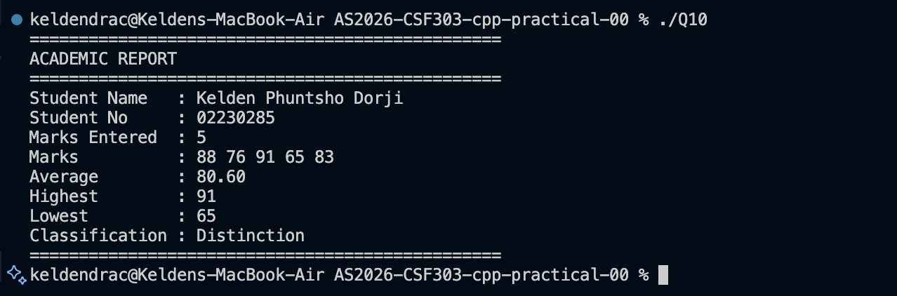

# AS2026-CSF303-cpp-practical-00

## C++ Programming — Practical Exercises

**Student:** Kelden Phuntsho Dorji  
**Student No:** 02230285  
**Course:** BE Software Engineering  

---

## 📋 About This Work

This repository contains 10 C++ practical exercises covering core programming concepts including:
variables & output formatting, arithmetic operations, string manipulation, user input,
conditionals, loops, arrays, functions, vectors (STL), and object-oriented programming (OOP).

Each program is personalised with my name and student number.

---

## ▶️ How to Compile & Run

```sh
g++ Q01.cpp -o Q01 && ./Q01
```

Replace `Q01` with any question number (Q02–Q10) to run that program.

---

## Q01 — Personal Introduction Output

Declares string and integer variables and prints a formatted student profile using `cout`.

```sh
g++ Q01.cpp -o Q01 && ./Q01
```



---

## Q02 — Arithmetic with Student Number

Computes digit sum, odd/even check, remainder when divided by 7, and student number multiplied by 3.

```sh
g++ Q02.cpp -o Q02 && ./Q02
```



---

## Q03 — String Manipulation & Analysis

Displays full name length, uppercase, lowercase, initials, and first name length.

```sh
g++ Q03.cpp -o Q03 && ./Q03
```



---

## Q04 — User Input & Type Conversion

Prompts user for name, student number, and age. Calculates birth year and year at age 100.

```sh
g++ Q04.cpp -o Q04 && ./Q04
```



---

## Q05 — Conditional Grade Classification

Takes a mark input (0–100), validates it, and classifies as Distinction / Merit / Pass / Fail.

```sh
g++ Q05.cpp -o Q05 && ./Q05
```



---

## Q06 — Loop-Based Pattern Generation

Prints first name N times, a right-angled asterisk triangle, and a multiplication times table.

```sh
g++ Q06.cpp -o Q06 && ./Q06
```



---

## Q07 — Array Operations & Statistics

Uses a hardcoded marks array to display each mark with a bar chart, plus highest, lowest, average, and above-average count.

```sh
g++ Q07.cpp -o Q07 && ./Q07
```



---

## Q08 — Function Design & Modular Programming

Implements and calls four functions: `digitSum`, `isPrime`, `countVowels`, and `reverseString`.

```sh
g++ Q08.cpp -o Q08 && ./Q08
```



---

## Q09 — Vector & Dynamic Collections

Uses STL `vector` to accept 6 user inputs, sort, find min/max/sum/average, and filter below-average values.

```sh
g++ Q09.cpp -o Q09 && ./Q09
```



---

## Q10 — Classes & Object-Oriented Design

Defines a `Student` class with private attributes and methods: `addMark`, `getAverage`, `getHighest`, `getLowest`, and `printReport`.

```sh
g++ Q10.cpp -o Q10 && ./Q10
```

# KeldenPDorji-AS2026-CSF303-cpp-practical-00
